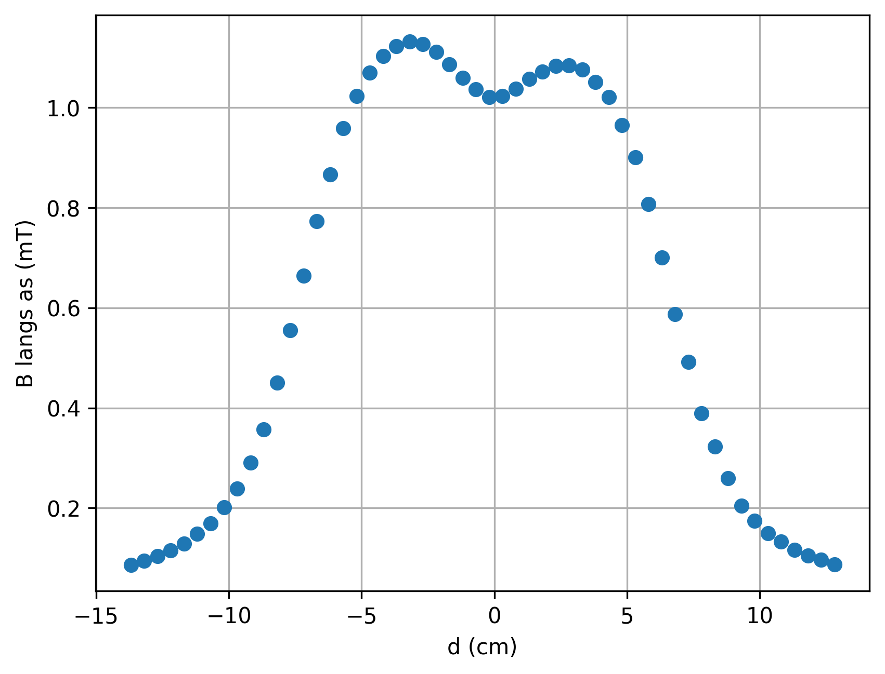
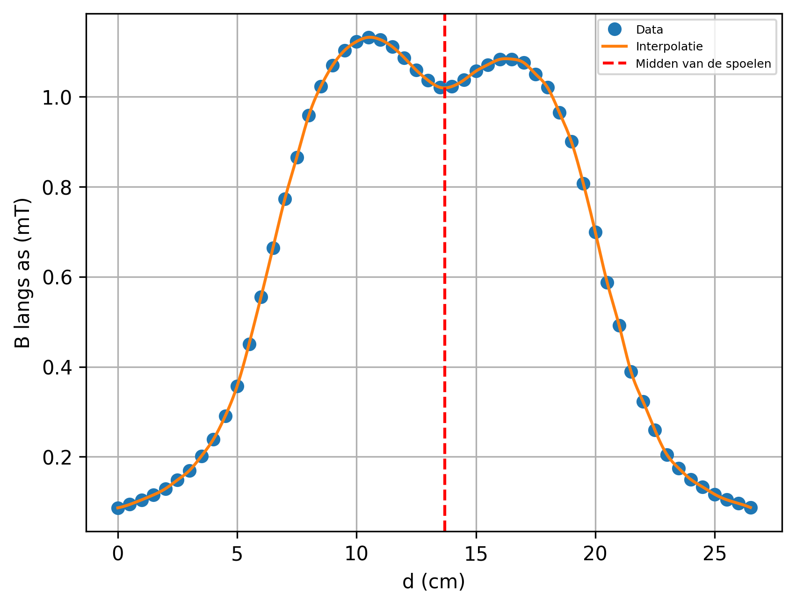

# Verslag Faraday-effect project experimenteren 2

## Practicumsessie 1:

Deze sessie hebben we ons vooral bezig gehouden om onze opstelling klaar te zetten en hebben we de kalibratie al kunnen meten met onze Nano Arduino. De data werd per halve centimeter uitgelezen waarna we een numerieke integratie hebben uitgevoerd. Volgende figuur toont de plot van onze ruwe datapunten weer.

In deze figuur zie je dat ons magnetisch veld niet mooi homogeen is en er een dal in het midden gemeten werd. Dit komt doordat we twee spoelen aan elkaar hebben gehangen met lijm en er in het midden van onze spoel wat magnetische velden naar buiten konden ontsnappen.

Door deze datapunten te interpoleren vonden we mooi een fit van het magnetisch veld waarvan je het resultaat hieronder ziet. Uiteindelijk hebben we op onze interpolatie een mask uitgevoerd op het interval $\in [10,17]$ cm om het minimum te vinden van ons magnetisch veld in het midden, wat ons ook meteen zegt op welke afstand het midden van onze spoel ligt.

